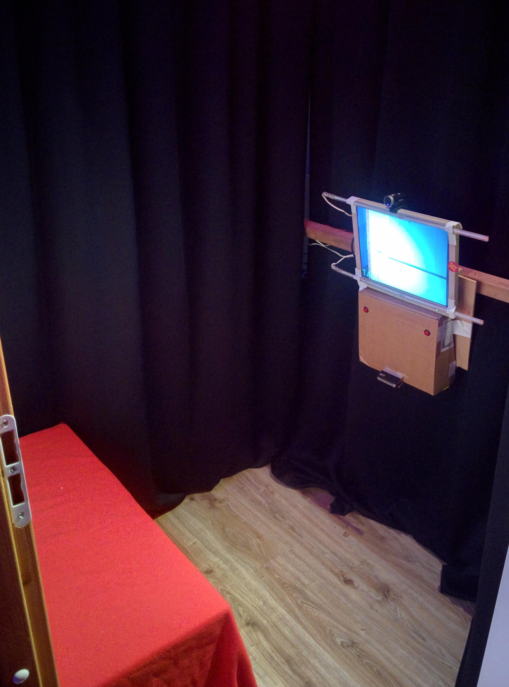
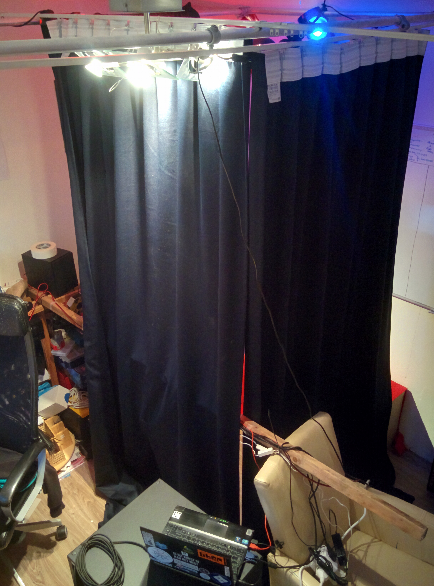
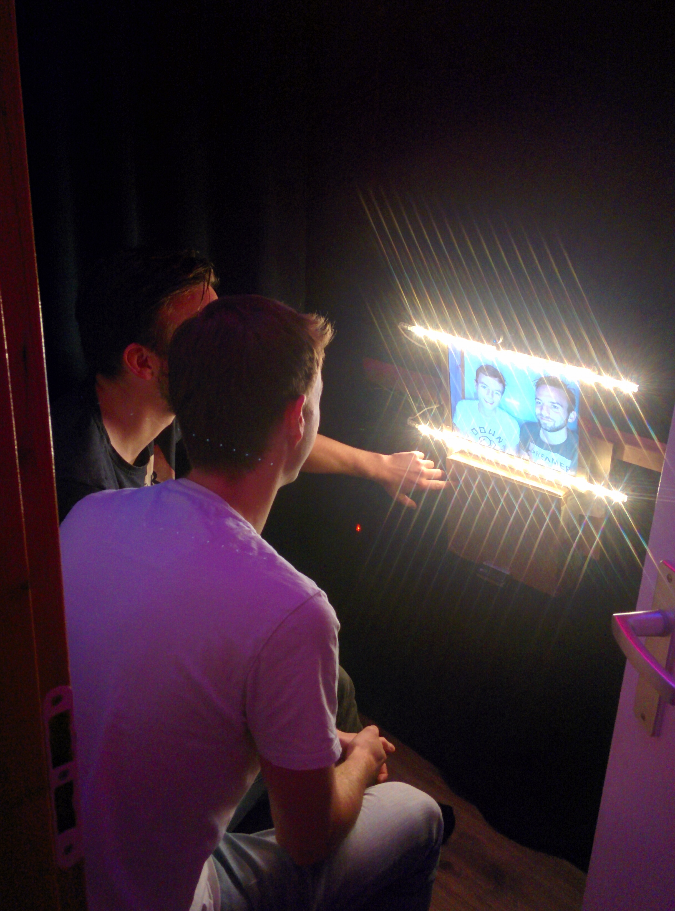

This repository contains scripts for a photobooth.
It shows webcam output, allows taking photos with
custom (physical) buttons, and sends the photo
over bluetooth to a Polaroid PoGo photo-printer.

Installation
============

Install all requirements:

    sudo apt-get install bluetooth blueman ussp-push python-bluetooth libbluetooth-dev`
    sudo pip3 install -r requirements.txt

Install OpenCV 3.0+ including Python 3 support. At the moment this requires
compiling from source; for instructions see:
http://www.pyimagesearch.com/2015/07/20/install-opencv-3-0-and-python-3-4-on-ubuntu/

If you're using blueman for file transfers (default; see polaroid.py),
pair your Polaroid PoGo device manually using `blueman-applet`.
If you're using ussp-push, run the setup script:

    cd src
    sudo python setup.py

I've had some problems getting bluetooth transfer to work;
different people are reporting variations in success with
different tools. You might need to experiment a bit, pair
via the various UI's and print some test selfies while
looking annoyed.

Physical installation
=====================

Build a physical photobooth with a screen, webcam, raspberry pi or other
computer, and some control buttons. Attach a Polaroid PoGo photo-printer.
I connected two push buttons to a MakeyMakey, emulating a keyboard's
space (left button, YES) and some other key (right button, NO). You may
need to experiment with different lights as well to get a clear image.

Running
=======

To run the GUI application, start with:

    python3 main.py

The application starts fullscreen. If it doesn't, hit your favourite
window manager's shortcut (WIN+F for Awesome-WM) once.
Hit the YES key to take a picture and confirm to print or retake to
take a new picture.

